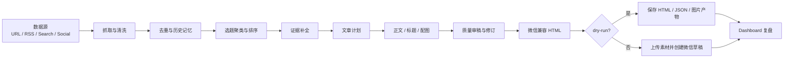
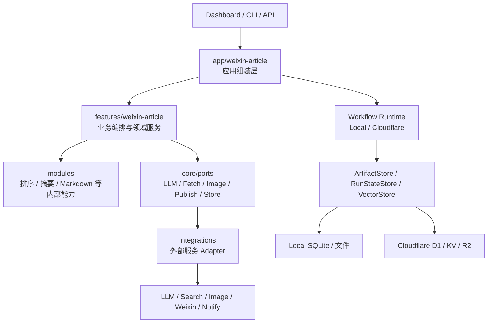

# TrendPublish

TrendPublish
是一个面向微信公众号的自动化选题与发布系统。它从你指定的数据源中抓取内容，用 AI
做选题、证据补全、排序、标题、正文生成、审稿、排版和配图，最后生成可预览的
dry-run 产物或创建微信公众号草稿。

它不是一个简单的 RSS
摘要脚本，而是一条可观察、可回滚、可调参的文章生产流水线：每次运行都会留下步骤、错误、质量审稿、HTML、图片和配置快照，方便你复盘为什么这篇文章值得发，以及哪里需要人工介入。

项目当前聚焦一条主链路：**微信文章自动发布**。本地、Docker 和 Cloudflare
都使用同一套 TypeScript 配置模型；Dashboard
中可编辑数据源、文章方案、共享能力和定时规则，下一次运行即时生效，密钥仍留在部署环境中。


示例公众号：**示例公众号**

社区交流：

- 讨论：https://github.com/maojunzc/ai-trend-publish/discussions
- 问题反馈：https://github.com/maojunzc/ai-trend-publish/issues

## 为什么做这个

日更类公众号真正耗时的不是“让模型写一段摘要”，而是稳定地完成这些事情：

- 找到足够好的材料，而不是每次只抓到一批重复新闻。
- 判断今天该写什么，哪些只适合短讯，哪些应该跳过。
- 保留证据链，避免文章看起来流畅但事实支撑不足。
- 标题和正文要像人写的内容，不能一眼看出是模板化 AI 速递。
- 图片、排版、微信兼容 HTML、草稿发布、失败重试都要稳定。
- 出错时要能看到是哪一步失败，而不是只得到一个终端异常。

TrendPublish 的设计目标就是把这些步骤变成一条清晰的自动化流程：AI
可以参与选题和创作，但每一步都可追踪、可配置、可 dry-run。

## 核心特点

- **文章质量优先**：内置选题聚类、编辑决策、文章计划、质量审稿和最多一次定向修订，不只做摘要拼接。
- **多源内容发现**：支持普通网页、RSS/RSSHub、FireCrawl、Jina
  Reader/Search、Brave、Tavily、Exa、Serper、NewsAPI、GDELT、Hacker
  News、arXiv、Twitter/X、Xquik。
- **证据链与补充搜索**：可以用搜索型数据源补全上下文，把选题依据和风险写进运行产物。
- **微信友好渲染**：内置多套公众号模板，支持 `dynamic` 动态排版，所有 HTML
  都会做微信兼容清洗。
- **AI 配图**：支持阿里云图片生成和 MiniMax 图片生成，可用于封面图和正文配图。
- **可观察工作流**：Dashboard
  可查看运行列表、步骤时间线、错误解释、质量报告、HTML/JSON/图片产物。
- **多公众号矩阵运营**：relay 负责安全代理多个公众号，Dashboard
  维护每个账号的定位、受众、语气、默认文章方案，并支持矩阵 dry-run。
- **运行时配置中心**：数据源、文章方案、能力 Profile、定时规则可在 Dashboard
  修改，下一次运行生效。
- **部署方式灵活**：本地/Docker 保持完整能力；Cloudflare 使用
  Worker/Workflows/D1/KV/R2 原生运行；微信真实发布可通过固定 IP relay。
- **能力可扩展**：大模型、抓取、图片生成、通知、向量去重、发布都以
  provider/adapter 方式接入，后续扩展不会改穿业务层。

## 产品界面

发布中心会先告诉你最近一次运行结果、当前是否建议进入草稿箱，以及下一步应该检查什么。


运行页展示每次 workflow
的步骤、耗时、错误、人工反馈和产物入口，便于定位问题和复盘文章质量。


质量复盘页包含选题工作台，可以看到候选主题、入选/跳过原因、账号适配和审稿结果。
你也可以直接给候选主题标记“锁主线 / 采用 / 跳过”，这些反馈会进入账号级学习，
帮助下一次选题更贴近该账号的风格。

系统设置页用于维护文章方案、定时规则、共享能力和高级
JSON。日常使用不需要手写配置文件。


## 适合场景

- 每天自动整理 AI、技术、产品、商业或研究资讯，并发布到微信公众号。
- 维护一组固定数据源，让系统自动发现值得写的选题。
- 在正式发布前先 dry-run，审阅 HTML、配图、质量报告和错误。
- 用 Cloudflare 定时运行，或在自己的服务器/Docker 上完整部署。
- 后续希望扩展到小红书、邮件简报、飞书文档、静态站等其他内容出口。

## 工作流



## 快速开始

### 1. 安装运行环境

需要 Deno v2.0.0 或更高版本。

Windows:

```powershell
irm https://deno.land/install.ps1 | iex
```

macOS / Linux:

```bash
curl -fsSL https://deno.land/install.sh | sh
```

### 2. 克隆项目

```bash
git clone https://github.com/maojunzc/ai-trend-publish.git
cd ai-trend-publish
```

### 3. 创建配置

```bash
cp trendpublish.config.example.ts trendpublish.config.ts
deno task doctor
```

最小配置只需要服务密钥和一套大模型配置：

```ts
import { defineConfig } from "@src/utils/config/define-config.ts";

export default defineConfig({
  server: {
    apiKey: "your-api-key",
  },
  providers: {
    ai: {
      baseUrl: "https://api.deepseek.com/v1",
      apiKey: "your-ai-api-key",
      model: "deepseek-chat",
    },
  },
  features: {
    article: {
      dryRun: true,
      renderer: {
        template: "minimal",
        promptProfile: "technology",
      },
      sources: [
        "https://news.ycombinator.com/",
      ],
    },
  },
});
```

更多配置见 [配置说明](docs/configuration.md)。

### 4. 本地验证

```bash
# 检查配置和必填项
deno task doctor

# 预览全部微信模板
deno task preview

# 跑一次微信文章流程，不上传、不发布
deno task article --dry-run

# 跑多公众号矩阵 dry-run；不指定账号时使用全部启用账号
deno task article --matrix
deno task article --matrix --account main,lab

# 启动本地 API 服务 + Dashboard 前端热更新
deno task dev
```

`deno task dev` 会同时启动后端服务 `http://localhost:8000` 和 Vite Dashboard
`http://localhost:5173/dashboard/`，前端修改会自动刷新并代理 `/api` 到本地后端。

`article --dry-run` 会把渲染后的 HTML 输出到
`src/temp/`，适合正式发布前检查正文效果。 `article --matrix`
会为每个账号创建独立 dry-run，并在运行记录里生成矩阵父批次汇总和账号对比产物，
用于检查主线、文章形态和质量分是否真正拉开差异。

## 配置原则

TrendPublish 的配置分成三层：

- `providers`：只放外部服务凭证和默认能力参数。
- `features.article`：决定微信文章工作流开启哪些功能、选择哪个
  provider、使用什么参数。
- `storage.runtimeConfig`：保存 Dashboard 可编辑的运行时业务配置。本地/Docker 用
  SQLite，Cloudflare 用 D1；密钥不会写入数据库。

例如，开启正文 AI 配图时：

```ts
providers: {
  image: {
    dashscope: { apiKey: "your-dashscope-api-key" },
  },
},
features: {
  article: {
    bodyImages: {
      mode: "missing",
      provider: "dashscope",
      count: 1,
      size: "1024*1024",
    },
  },
},
```

这样可以避免“凭证配置”和“功能开关”混在一起。

## 常用功能开关

| 目标           | 配置位置                                  | 说明                                                                         |
| -------------- | ----------------------------------------- | ---------------------------------------------------------------------------- |
| 选择文章模板   | `features.article.renderer.template`      | 支持 `minimal`、`longform`、`product`、`dynamic` 等                          |
| 选择提示词风格 | `features.article.renderer.promptProfile` | 支持 `technology`、`business`、`product`、`developer`、`research`、`general` |
| 配置数据源     | `features.article.sources`                | 直接写 URL，也可以用 `group:url` 指定抓取分组                                |
| 配置抓取策略   | `fetchGroups`                             | 分组内 provider 按顺序 fallback                                              |
| 开启封面生图   | `features.article.cover`                  | 支持 `dashscope` / `minimax`，需要对应 `providers.image.*.apiKey`            |
| 开启正文配图   | `features.article.bodyImages`             | 失败时回退已有原文图片布局                                                   |
| 开启向量去重   | `features.article.deduplication`          | 需要 embedding provider；本地/Docker 用 SQLite，Cloudflare 用 D1             |
| 开启通知       | `features.article.notifications.channels` | 支持 Bark、钉钉、飞书                                                        |
| 页面改配置     | `storage.runtimeConfig`                   | Dashboard 保存 Profile、数据源、抓取分组和定时规则，下一次运行生效           |
| 接入日志观测   | `observability`                           | 所有 `Logger` 输出可镜像到 stdout、Axiom、Better Stack 或 HTTP ingest        |
| 正式发布微信   | `features.article.dryRun: false`          | 本地固定 IP 用 `weixin`，Cloudflare 推荐 `weixin-relay`                      |
| 多公众号发布   | `features.article.publisher.accountId`    | 对应 `providers.publish.weixin.accounts` 的账号 ID；relay 只做凭证透传代理   |
| 矩阵运营       | Dashboard `账号矩阵`                      | 编辑账号定位、默认方案和来源分组，运行后展示账号级质量趋势、风险和学习建议   |

完整字段说明见 [配置说明](docs/configuration.md)。

## 数据源写法

最简单的写法是直接放 URL：

```ts
features: {
  article: {
    sources: [
      "https://news.ycombinator.com/",
      "https://openai.com/news/",
    ],
  },
},
fetchGroups: {
  default: ["auto"],
},
```

需要指定抓取策略时，可以使用自定义分组前缀：

```ts
providers: {
  fetch: {
    firecrawl: { apiKey: "your-firecrawl-api-key" },
    jina: { apiKey: "your-jina-api-key" },
    twitter: { xquikApiKey: "your-xquik-api-key" },
  },
},
fetchGroups: {
  default: ["auto"],
  web: ["firecrawl", "jina"],
  social: ["twitter"],
},
features: {
  article: {
    sources: [
      "web:https://openai.com/news/",
      "social:https://x.com/OpenAIDevs",
    ],
  },
},
```

`web:` 和 `social:` 不是固定 provider 名，而是你自己定义的抓取分组名。

## 支持的服务

当前版本建议先用一套稳定的大模型配置跑通主链路，再按需开启抓取增强、图片生成、
去重和通知。

### AI 大模型

- OpenAI：[申请地址](https://platform.openai.com/api-keys)； `baseUrl` 填
  `https://api.openai.com/v1`；`model` 按平台模型列表选择。
- DeepSeek：[申请地址](https://platform.deepseek.com/api_keys)； `baseUrl` 填
  `https://api.deepseek.com/v1`；常用模型为 `deepseek-chat`、
  `deepseek-reasoner`。
- 通义千问 / DashScope：[申请地址](https://bailian.console.aliyun.com/)；\
  `baseUrl` 填 `https://dashscope.aliyuncs.com/compatible-mode/v1`；常用模型为\
  `qwen-plus`、`qwen-max`。

### 数据源获取

- 普通网页 URL：直接写到 `features.article.sources`。
- RSS / RSSHub：直接写 RSS URL；RSSHub 可配置 `providers.fetch.rss.baseUrl`。
- FireCrawl：[申请地址](https://firecrawl.dev/)；配置
  `providers.fetch.firecrawl.apiKey`。
- Jina Reader / Search：[申请地址](https://jina.ai/reader/)；配置
  `providers.fetch.jina.apiKey`。
- Brave Search：[申请地址](https://brave.com/search/api/)；配置
  `providers.fetch.brave.apiKey`，适合作为低成本通用搜索入口。
- Tavily：[申请地址](https://www.tavily.com/)；配置
  `providers.fetch.tavily.apiKey`，适合 AI research / agent 风格搜索。
- Exa：[申请地址](https://exa.ai/)；配置 `providers.fetch.exa.apiKey`，
  适合语义搜索和研究型选题。
- Serper：[申请地址](https://serper.dev/)；配置
  `providers.fetch.serper.apiKey`，适合需要 Google SERP 覆盖的场景。
- NewsAPI：[申请地址](https://newsapi.org/)；配置
  `providers.fetch.newsapi.apiKey`，适合新闻搜索，生产限制以官方套餐为准。
- GDELT：无需 API Key，适合全球新闻线索。
- Hacker News：无需 API Key，适合技术社区线索。
- arXiv：无需 API Key，适合论文和研究线索。
- Twitter/X：[申请地址](https://developer.x.com/)；配置
  `providers.fetch.twitter.bearerToken`。
- Xquik：[申请地址](https://xquik.com/en/api-keys)；配置
  `providers.fetch.twitter.xquikApiKey`。
- 关键词搜索数据源写成 `search:关键词`，路由到 `fetchGroups.search`。

### 图片生成

- 阿里云图片生成：[申请地址](https://bailian.console.aliyun.com/)；配置
  `providers.image.dashscope.apiKey`。
- MiniMax 图片生成：[申请地址](https://platform.minimax.io/)；配置
  `providers.image.minimax.apiKey`，当前默认模型为 `image-01`。
- 阿里云封面图默认模型：`qwen-image-2.0-pro`，更适合中文标题和封面版式。
- 阿里云正文配图默认模型：`qwen-image-2.0`，也可手动配置 `wan2.7-image-pro`
  或兼容旧模型 `wanx2.1-t2i-turbo`。
- 正文配图通过 `features.article.bodyImages` 开启，可设置生成模型、数量和尺寸。
- 后续：OpenAI Images、Gemini / Imagen、Replicate、Stability、ComfyUI。

### 发布与素材

- 微信公众号：[申请地址](https://mp.weixin.qq.com/)；配置
  `providers.publish.weixin.appId` 和 `providers.publish.weixin.appSecret`。
- Cloudflare 真实发布推荐使用
  `weixin-relay`，微信凭证仍放在主服务配置中并按次透传。
- 当前支持：封面上传、正文图片上传、草稿创建和发布。
- 正式发布前需要在公众号后台配置 IP 白名单。
- 后续：Twitter/X thread、Telegram、飞书文档、Notion、静态站点、Webhook。

### 去重、存储和通知

- 向量去重：DashScope Embedding；常用模型为 `text-embedding-v3`。
- 存储：本地/Docker 使用文件和 SQLite；Cloudflare 原生模式使用 R2、KV、D1。
- 通知：当前支持 Bark、钉钉机器人、飞书机器人。
- 后续：OpenAI / Jina / BGE Embedding、PostgreSQL、SQLite、Vectorize、
  企业微信、Telegram、Slack、Discord、邮件通知。

## 微信模板

模板通过 `features.article.renderer.template` 选择：

- `minimal`：极简阅读风，适合稳定日更。
- `longform`：长文杂志风，适合深度整理。
- `product`：产品更新风，适合产品、工具、版本动态。
- `darktech`：深色研究笔记风。
- `dynamic`：AI 根据本次文章内容实时生成公众号正文 HTML，失败时自动回退
  `minimal`。

也可以使用 `default`、`modern`、`tech`、`mianpro`、`random`。模板展示见
[模板文档](docs/templates.md) 或
[在线展示](https://maojunzc.github.io/ai-trend-publish/templates)。

## 常用命令

```bash
# 日常使用
deno task doctor
deno task dev
deno task article --dry-run
deno task article --matrix --account main,lab
deno task article
deno task preview

# 质量检查
deno task verify
deno task test

# 本地前端/文档开发
deno task dashboard
deno task docs

# 部署
deno task docker
deno task relay
deno task cf deploy
```

`deno task dashboard` 只启动 Dashboard 前端 dev server；日常开发推荐直接用
`deno task dev`，它会同时启动后端和前端 watch。

## 项目结构

整体采用 modular monolith：业务能力集中在微信文章 feature，外部服务统一放在
integrations，运行时和存储通过 ports 隔离。



```text
src/
  app/weixin-article/          # 应用组装层：创建 provider、规划抓取、定义 workflow
  features/weixin-article/     # 微信文章业务模型、服务、渲染和 workflow
  integrations/                # 外部服务 adapter：LLM、fetch、image、publish、notify、vector
  core/                        # workflow runtime、ports 和通用基础能力
  modules/                     # 内容排序、摘要、Markdown 转换等内部可复用能力
  platform/cloudflare/         # Cloudflare 可选部署入口
  platform/local/              # 本地 artifact 和运行状态存储
  utils/config/                # TypeScript 配置定义、解析与校验
```

架构细节见 [架构总览](docs/architecture.md)。

## 发布与部署

### 部署方式

部署时先选一种形态：

- **本地开发**：改代码、调 Dashboard、跑 dry-run。
- **Docker 服务器**（推荐）：使用 GitHub Actions CI/CD 自动构建并部署。
- **Cloudflare Workflows**：适合 Serverless 定时运行，使用 Worker + Workflows + D1/KV/R2。

### 本地开发

```bash
cp trendpublish.config.example.ts trendpublish.config.ts
deno task doctor
deno task dev
```

### Docker 部署（手动）

```bash
mkdir -p config data/temp
cp trendpublish.config.docker.example.ts config/trendpublish.config.ts
deno task docker
```

Docker 默认使用 `ghcr.io/maojunzc/ai-trend-publish:latest`，配置挂载到
`/app/config/trendpublish.config.ts`，运行产物挂载到 `/app/src/temp`。

### Docker 部署（自动 CI/CD）

项目已配置 GitHub Actions，每次推送代码到 `master` 分支时会自动构建并部署到生产服务器：

1. 在 GitHub 仓库设置中添加以下 Secrets：

| Secret | 说明 |
|--------|------|
| `DEPLOY_HOST` | 服务器 IP 地址 |
| `DEPLOY_USER` | SSH 用户名 |
| `DEPLOY_PORT` | SSH 端口（默认 22） |
| `DEPLOY_SSH_KEY` | SSH 私钥内容（与服务器公钥配对） |

2. 在服务器上准备部署环境：

```bash
# 创建项目目录
mkdir -p /home/ubuntu/ai-trend-publish/config

# 复制配置文件
cp trendpublish.config.docker.example.ts /home/ubuntu/ai-trend-publish/config/trendpublish.config.ts

# 创建环境变量文件
cat > /home/ubuntu/ai-trend-publish/.env << 'EOF'
SERVER_API_KEY=your-server-api-key
AI_BASE_URL=https://api.deepseek.com/v1
AI_API_KEY=your-ai-api-key
AI_MODEL=deepseek-chat
EOF
```

3. 此后每次推送代码，GitHub Actions 会自动：
   - 运行 `deno check` 类型检查
   - 构建 Docker 镜像
   - 通过 SCP 将镜像传输到服务器
   - 加载新镜像并重启容器
   - 执行健康检查验证

```bash
git push origin master  # 自动触发 CI/CD
```

CI/CD 流程定义在 [`.github/workflows/ci-deploy.yml`](.github/workflows/ci-deploy.yml)。

Cloudflare 部署：

```bash
deno task cf dry-run
deno task cf migrate
deno task cf deploy
deno task cf smoke --url https://<worker-domain> --api-key <SERVER_API_KEY>
```

微信真实发布需要固定 IP：

- 本地/Docker 有固定 IP：可以直连微信。
- Cloudflare：推荐把 `weixin-relay` 部署到固定 IP 机器，Cloudflare 只调用
  relay，并把本次发布账号的微信凭证透传给 relay。

relay 和主服务使用同一个镜像、同一套配置结构：

```bash
deno task docker relay
```

relay 只保存自己的 `server.apiKey`，不保存公众号 AppID/AppSecret，也不维护账号
列表。多公众号时，微信凭证和账号运营信息都在主服务侧维护；relay 只负责固定 IP
转发微信 API。

部署细节见 [部署文档](docs/deployment.md)。

## JSON-RPC API

服务启动后提供 `POST /api/workflow`，可手动触发微信文章工作流。

```bash
curl -X POST http://localhost:8000/api/workflow \
  -H "Content-Type: application/json" \
  -H "Authorization: Bearer your-api-key" \
  -d '{
    "jsonrpc": "2.0",
    "method": "triggerWorkflow",
    "params": {
      "workflowType": "weixin-article-workflow",
      "dryRun": true
    },
    "id": 1
  }'
```

更多说明见 [JSON-RPC API 文档](docs/api/json-rpc-api.md)。

## 相关文档

- [快速开始](docs/getting-started.md)
- [配置说明](docs/configuration.md)
- [架构总览](docs/architecture.md)
- [模板文档](docs/templates.md)
- [部署文档](docs/deployment.md)
- [Jina 集成指南](docs/integrations/jina-integration-guide.md)
- [钉钉通知指南](docs/integrations/dingtalk-webhook-guide.md)

## 社区与贡献

- Discord: [https://discord.gg/mrZvBHNawS](https://discord.gg/mrZvBHNawS)
- QQ 群：TrendPublish-1

欢迎提交 Issue 和 Pull Request。建议在提交前先运行：

```bash
deno task verify
```

## 致谢

感谢社区贡献者对项目的支持。

## Star History

[Star History Chart](https://star-history.com/#maojunzc/ai-trend-publish&Date)

## License

本项目使用 MIT License，详见 [LICENSE](LICENSE)。
