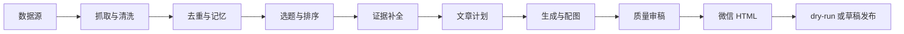

# TrendPublish 文档

TrendPublish
是一个面向微信公众号的自动化选题与发布系统。它会从指定数据源抓取内容，用 AI
完成选题、证据补全、排序、标题、正文、审稿、排版和配图，最后生成 dry-run
产物或创建微信公众号草稿。

它的核心目标不是“自动生成一篇文章”，而是稳定地生产更值得发布的文章：每次运行都有步骤、错误、质量审稿、HTML、图片和配置快照，方便你判断今天是否适合发、为什么值得发、哪里需要人工介入。

## 工作流概览

## 文档阅读路径

### 新用户

1. [快速开始](/getting-started)
2. [配置说明](/configuration)
3. [帮助文档](/help)

### 开发与运维

1. [架构总览](/architecture)
2. [部署与发布](/deployment)
3. [Editorial Automation 计划](/editorial-automation)
4. [JSON-RPC API](/api/json-rpc-api)

## 核心能力

- 多源内容抓取：网页、RSS、Search API、Hacker News、arXiv、Twitter/X 等。
- 文章质量链路：选题聚类、编辑决策、文章计划、证据补全、质量审稿、定向修订。
- 微信公众号发布：微信兼容 HTML、封面和正文图片上传、草稿创建、dry-run 预览。
- 配图能力：阿里云图片生成和 MiniMax 图片生成。
- 运行看板：查看运行列表、步骤时间线、错误解释、产物预览和人工反馈。
- 运行时配置：数据源、文章方案、能力 Profile、定时规则可在 Dashboard 修改。
- 部署方式：本地、Docker、Cloudflare Worker/Workflows。

## 文档目录

- [快速开始](/getting-started)
- [配置说明](/configuration)
- [架构总览](/architecture)
- [Editorial Automation 计划](/editorial-automation)
- [部署与发布](/deployment)
- [帮助文档](/help)
- [JSON-RPC API](/api/json-rpc-api)
- [钉钉 Webhook 配置](/integrations/dingtalk-webhook-guide)
- [数据获取 API](/integrations/data-fetching-apis)
- [Jina AI 集成指南](/integrations/jina-integration-guide)
- [模板展示](/templates)

## 相关链接

- GitHub: [maojunzc/ai-trend-publish](https://github.com/maojunzc/ai-trend-publish)
- Discord: <https://discord.gg/mrZvBHNawS>
